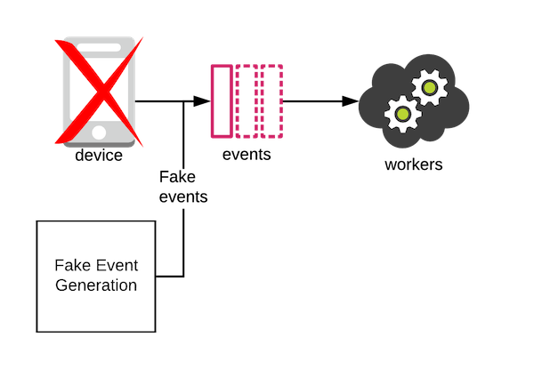
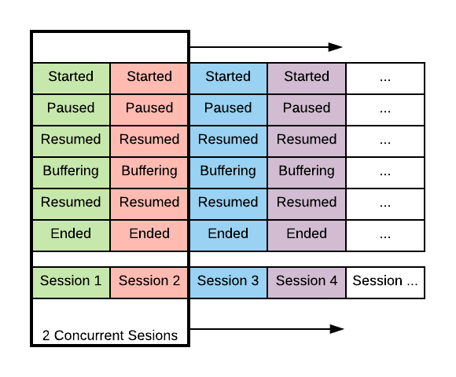

class: center, middle, inverse

# Fake it till you make it with FS2

James Collier @JRCCollier


---

## Playback Session

Telemetry events will be emitted from devices.

```scala mdoc
import java.time.Instant
import java.util.UUID

sealed trait PlaybackEvent {
  def sessionId: UUID
}
final case class Started(timestamp: Instant, sessionId: UUID) extends PlaybackEvent
final case class Paused(timestamp: Instant, sessionId: UUID) extends PlaybackEvent
final case class Resumed(timestamp: Instant, sessionId: UUID) extends PlaybackEvent
final case class Ended(timestamp: Instant, sessionId: UUID) extends PlaybackEvent
```

---

## 1000ft view


---
class: inverse

## The catch

😱 it's going to be a while till devices are instrumented!

--

The show must go on!

--

Need to develop while application teams are instrumenting.

---

## Fake it till we instrument it

We have the ~~technology~~ schema, we can build the events.

--



---

## Let's just use scalacheck!

```scala mdoc:silent
import org.scalacheck.ScalacheckShapeless._
import org.scalacheck.{Arbitrary, Gen}

private implicit val arbInstant: Arbitrary[Instant] =
    Arbitrary(Gen.calendar.map(_.toInstant))
val arbPlaybackEvt = implicitly[Arbitrary[PlaybackEvent]]
```

Now let's generate some events...

--

```scala mdoc
List.fill(10)(arbPlaybackEvt.arbitrary.sample).flatten
```

😱 not useful!

???

* timestamp is nonsense.
* each event has it's own session.
* not a representative lifecycle.

---

## Requirements

* Sessions modelled.
* Representative delays between events.
* Configure the number of concurrent sessions.

--

Maybe this can be modelled as streams?

--

Step in FS2:


```scala mdoc:silent
import cats.effect._
import fs2.Stream
import scala.concurrent.ExecutionContext
import scala.concurrent.duration._
```

```scala mdoc:invisible
import cats.effect.laws.util.TestContext

val testContext = TestContext()
implicit val timer: Timer[IO] =
  testContext.timer(IO.ioEffect)
implicit val cs: ContextShift[IO] =
  testContext.contextShift(IO.ioEffect)

testContext.tick(49 * 365.days)
```

---

## Model a playback scenario

```scala mdoc:silent
def session: Stream[IO, PlaybackEvent] = for {
  now <- Stream.emit(Instant.parse("2019-11-26T12:00:00Z"))
  sessionId <- Stream.eval(IO(UUID.randomUUID()))
  s <- Stream.emits(List(
    Started(now, sessionId),
    Ended(now.plusSeconds(60), sessionId)
  ))
} yield s
```

--

```scala mdoc
session.compile.toList.unsafeRunSync()
```

---

## Nap between events 💤💤💤

Useful to model the progress of time between emitting
events for a session.

--

```scala mdoc:silent
def nowS: Stream[IO, Instant] =
  Stream.eval(timer.clock.realTime(MILLISECONDS).map(Instant.ofEpochMilli))

def idealSession: Stream[IO, PlaybackEvent] = for {
  sessionId <- Stream.eval(IO(UUID.randomUUID()))
  s <- nowS.map(Started(_, sessionId)) ++
    nowS.map(Ended(_, sessionId)).delayBy(30.minutes)
} yield s
```

--

```scala mdoc
idealSession
  .evalMap(event => IO(println(event)))
  .compile
  .drain
  .unsafeRunAsyncAndForget()
testContext.tick(1.hour)
```

---

## A stream of sessions



???

Par join to choose how many concurrent sessions to have.

---

## Concurrent sessions

```scala mdoc:silent
val numConcurrent = 3

Stream.emit(idealSession)
  .repeat
  .take(5) // limit to 5 for example
  .parJoin(numConcurrent)
  .evalMap(event => IO(println(event)))
  .compile
  .drain
  .unsafeRunAsyncAndForget()
```

--

```scala mdoc
testContext.tick(1.hour)
```

???

Sessions are repeated forever.

---

## Add another scenario!

```scala mdoc:silent
def pauseSession: Stream[IO, PlaybackEvent] = for {
  sessionId <- Stream.eval(IO(UUID.randomUUID()))
  s <- nowS.map(Started(_, sessionId)) ++
    nowS.map(Paused(_, sessionId)).delayBy(20.seconds) ++
    nowS.map(Resumed(_, sessionId)).delayBy(5.seconds) ++
    nowS.map(Ended(_, sessionId)).delayBy(20.minutes)
} yield s
```

---

## Running multiple scenarios

```scala mdoc:silent
Stream.emits(List(idealSession, pauseSession))
  .repeat
  .take(4) // limit to 4 for example
  .parJoin(numConcurrent)
  .evalMap(event => IO(println(event)))
  .compile
  .drain
  .unsafeRunAsyncAndForget()
```

--

```scala mdoc
testContext.tick(1.hour)
```

---

## Testing

Can use `cats.effect.laws.util.TestContext` to simulate time.

```scala mdoc:silent
val f = idealSession
  .compile
  .toList
  .unsafeToFuture()
```

--

```scala mdoc
f.value
```

--

```scala mdoc
testContext.tick(1.hour)
f.value
```

---

## Counting sessions

```scala mdoc:silent
val f2 = Stream.emit(idealSession)
  .repeat
  .parJoin(1000)
  .interruptAfter(1.hour)
  .compile
  .toList
  // count sessions
  .map(_.groupBy(_.sessionId).keySet.size)
  .unsafeToFuture()
```

`idealSession` lasts 30 minutes, so after 1 hour there should be ~2000 sessions.

--

```scala mdoc
testContext.tick(1.hour)
f2.value
```
👌

---

## Further reading and links

* [FS2](https://github.com/functional-streams-for-scala/fs2) by [@mpilquist](https://github.com/mpilquist)
* [cats-effect](https://github.com/typelevel/cats-effect)

## Thanks!

* [mdoc](https://github.com/scalameta/mdoc) used to evaluate scala examples

## Questions?
